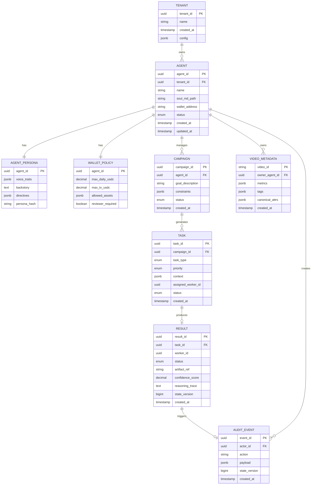

# Technical Specification

## Architecture
- Pattern: Hierarchical Swarm (Planner → Worker → Judge) with optional sub-planners; OCC at Judge commit.
- Transport: Redis queues (`task_queue`, `review_queue`); Planner polls perception signals and goals.
- External I/O: MCP only; stdio/SSE transports to MCP servers (twitter, ideogram/midjourney, runway/luma, coinbase, weaviate, sqlite exemplar).
- Tenancy: Hub-and-spoke; orchestrator maintains tenant-scoped configs and ensures isolation of memories/wallets.
- Observability: Telemetry via Tenx MCP Sense; audit log of all MCP tool calls to Postgres + on-chain ledger for commerce.

## Database & Data Management

### Entity Relationship Diagram (ERD)



### PostgreSQL Schema (Authoritative Data)

#### Table: `tenants`
```sql
CREATE TABLE tenants (
    tenant_id UUID PRIMARY KEY DEFAULT gen_random_uuid(),
    name VARCHAR(255) NOT NULL,
    created_at TIMESTAMP WITH TIME ZONE DEFAULT NOW(),
    config JSONB DEFAULT '{}'::jsonb,
    CONSTRAINT tenants_name_unique UNIQUE (name)
);

CREATE INDEX idx_tenants_created_at ON tenants(created_at);
```

#### Table: `agents`
```sql
CREATE TABLE agents (
    agent_id UUID PRIMARY KEY DEFAULT gen_random_uuid(),
    tenant_id UUID NOT NULL REFERENCES tenants(tenant_id) ON DELETE CASCADE,
    name VARCHAR(255) NOT NULL,
    soul_md_path VARCHAR(512),
    wallet_address VARCHAR(255),
    status VARCHAR(50) DEFAULT 'active' CHECK (status IN ('active', 'paused', 'archived')),
    created_at TIMESTAMP WITH TIME ZONE DEFAULT NOW(),
    updated_at TIMESTAMP WITH TIME ZONE DEFAULT NOW(),
    CONSTRAINT agents_tenant_name_unique UNIQUE (tenant_id, name)
);

CREATE INDEX idx_agents_tenant_id ON agents(tenant_id);
CREATE INDEX idx_agents_status ON agents(status);
CREATE INDEX idx_agents_wallet_address ON agents(wallet_address);
CREATE TRIGGER update_agents_updated_at BEFORE UPDATE ON agents
    FOR EACH ROW EXECUTE FUNCTION update_updated_at_column();
```

#### Table: `agent_personas`
```sql
CREATE TABLE agent_personas (
    agent_id UUID PRIMARY KEY REFERENCES agents(agent_id) ON DELETE CASCADE,
    voice_traits JSONB DEFAULT '[]'::jsonb,
    backstory TEXT,
    directives JSONB DEFAULT '[]'::jsonb,
    persona_hash VARCHAR(64),
    updated_at TIMESTAMP WITH TIME ZONE DEFAULT NOW()
);

CREATE INDEX idx_agent_personas_hash ON agent_personas(persona_hash);
```

#### Table: `wallet_policies`
```sql
CREATE TABLE wallet_policies (
    agent_id UUID PRIMARY KEY REFERENCES agents(agent_id) ON DELETE CASCADE,
    max_daily_usdc DECIMAL(18, 6) DEFAULT 0.0 CHECK (max_daily_usdc >= 0),
    max_tx_usdc DECIMAL(18, 6) DEFAULT 0.0 CHECK (max_tx_usdc >= 0),
    allowed_assets JSONB DEFAULT '[]'::jsonb,
    reviewer_required BOOLEAN DEFAULT false,
    updated_at TIMESTAMP WITH TIME ZONE DEFAULT NOW()
);
```

#### Table: `campaigns`
```sql
CREATE TABLE campaigns (
    campaign_id UUID PRIMARY KEY DEFAULT gen_random_uuid(),
    agent_id UUID NOT NULL REFERENCES agents(agent_id) ON DELETE CASCADE,
    goal_description TEXT NOT NULL,
    constraints JSONB DEFAULT '{}'::jsonb,
    status VARCHAR(50) DEFAULT 'draft' CHECK (status IN ('draft', 'active', 'paused', 'completed')),
    created_at TIMESTAMP WITH TIME ZONE DEFAULT NOW(),
    updated_at TIMESTAMP WITH TIME ZONE DEFAULT NOW()
);

CREATE INDEX idx_campaigns_agent_id ON campaigns(agent_id);
CREATE INDEX idx_campaigns_status ON campaigns(status);
CREATE INDEX idx_campaigns_created_at ON campaigns(created_at);
```

#### Table: `tasks`
```sql
CREATE TABLE tasks (
    task_id UUID PRIMARY KEY DEFAULT gen_random_uuid(),
    campaign_id UUID REFERENCES campaigns(campaign_id) ON DELETE SET NULL,
    task_type VARCHAR(50) NOT NULL CHECK (task_type IN ('generate_content', 'reply_comment', 'execute_transaction', 'fetch_trends')),
    priority VARCHAR(20) DEFAULT 'medium' CHECK (priority IN ('low', 'medium', 'high')),
    context JSONB NOT NULL DEFAULT '{}'::jsonb,
    assigned_worker_id UUID,
    status VARCHAR(50) DEFAULT 'pending' CHECK (status IN ('pending', 'in_progress', 'review', 'complete', 'failed')),
    created_at TIMESTAMP WITH TIME ZONE DEFAULT NOW(),
    updated_at TIMESTAMP WITH TIME ZONE DEFAULT NOW()
);

CREATE INDEX idx_tasks_campaign_id ON tasks(campaign_id);
CREATE INDEX idx_tasks_status ON tasks(status);
CREATE INDEX idx_tasks_priority_status ON tasks(priority, status);
CREATE INDEX idx_tasks_created_at ON tasks(created_at);
CREATE INDEX idx_tasks_assigned_worker ON tasks(assigned_worker_id) WHERE assigned_worker_id IS NOT NULL;
```

#### Table: `results`
```sql
CREATE TABLE results (
    result_id UUID PRIMARY KEY DEFAULT gen_random_uuid(),
    task_id UUID NOT NULL REFERENCES tasks(task_id) ON DELETE CASCADE,
    worker_id UUID NOT NULL,
    status VARCHAR(50) NOT NULL CHECK (status IN ('success', 'failure', 'requires_hitl')),
    artifact_ref VARCHAR(512),
    confidence_score DECIMAL(3, 2) CHECK (confidence_score >= 0 AND confidence_score <= 1),
    reasoning_trace TEXT,
    state_version BIGINT NOT NULL,
    created_at TIMESTAMP WITH TIME ZONE DEFAULT NOW()
);

CREATE INDEX idx_results_task_id ON results(task_id);
CREATE INDEX idx_results_status ON results(status);
CREATE INDEX idx_results_confidence_score ON results(confidence_score);
CREATE INDEX idx_results_state_version ON results(state_version);
```

#### Table: `audit_events`
```sql
CREATE TABLE audit_events (
    event_id UUID PRIMARY KEY DEFAULT gen_random_uuid(),
    actor_id UUID NOT NULL REFERENCES agents(agent_id) ON DELETE CASCADE,
    action VARCHAR(100) NOT NULL,
    payload JSONB NOT NULL DEFAULT '{}'::jsonb,
    state_version BIGINT NOT NULL,
    created_at TIMESTAMP WITH TIME ZONE DEFAULT NOW()
);

CREATE INDEX idx_audit_events_actor_id ON audit_events(actor_id);
CREATE INDEX idx_audit_events_action ON audit_events(action);
CREATE INDEX idx_audit_events_created_at ON audit_events(created_at);
CREATE INDEX idx_audit_events_state_version ON audit_events(state_version);
```

### NoSQL Schema (High-Velocity Metrics)

#### Collection: `video_metadata` (MongoDB/Cassandra)
```javascript
{
  video_id: String (PK),
  owner_agent_id: UUID (indexed),
  metrics: {
    minute_buckets: [{ timestamp: ISODate, views: Number, likes: Number, shares: Number }],
    hour_buckets: [{ timestamp: ISODate, views: Number, engagement_rate: Number }],
    day_buckets: [{ timestamp: ISODate, total_views: Number, total_engagement: Number }]
  },
  tags: [String] (indexed),
  canonical_attrs: {
    title: String,
    duration: Number,
    language: String,
    platform: String
  },
  created_at: ISODate (indexed),
  updated_at: ISODate
}

// Indexes:
// - { owner_agent_id: 1, created_at: -1 }
// - { tags: 1 }
// - { "metrics.day_buckets.timestamp": 1 }
```

### Weaviate Schema (Semantic Memory)

```json
{
  "class": "AgentMemory",
  "description": "Long-term semantic memories for agents",
  "properties": [
    {
      "name": "agent_id",
      "dataType": ["string"],
      "description": "UUID of the agent"
    },
    {
      "name": "content",
      "dataType": ["text"],
      "description": "Memory content"
    },
    {
      "name": "timestamp",
      "dataType": ["date"],
      "description": "When the memory was created"
    },
    {
      "name": "memory_type",
      "dataType": ["string"],
      "description": "Type: interaction, trend, learning"
    }
  ],
  "vectorizer": "text2vec-openai"
}
```

### Migration & Versioning Strategy

- **Tool**: Alembic (Python) for PostgreSQL migrations
- **Naming**: `YYYYMMDD_HHMMSS_description.py`
- **Versioning**: Semantic versioning in `schema_version` table
- **Rollback**: Each migration includes both `upgrade()` and `downgrade()` functions
- **Multi-tenant**: All migrations must include `tenant_id` filtering for data isolation

Example migration:
```python
# migrations/20260205_120000_add_agent_status.py
def upgrade():
    op.add_column('agents', sa.Column('status', sa.String(50), nullable=False, server_default='active'))
    op.create_check_constraint('agents_status_check', 'agents', "status IN ('active', 'paused', 'archived')")

def downgrade():
    op.drop_constraint('agents_status_check', 'agents')
    op.drop_column('agents', 'status')
```

### Example Queries

#### Planner Queue (Get pending high-priority tasks)
```sql
SELECT task_id, task_type, context, created_at
FROM tasks
WHERE status = 'pending'
  AND priority = 'high'
ORDER BY created_at ASC
LIMIT 100;
```

#### Audit Log (Recent actions by agent)
```sql
SELECT action, payload, created_at, state_version
FROM audit_events
WHERE actor_id = $1
ORDER BY created_at DESC
LIMIT 50;
```

#### Persona Retrieval (Load agent persona with wallet policy)
```sql
SELECT 
    a.agent_id,
    a.name,
    ap.voice_traits,
    ap.backstory,
    ap.directives,
    wp.max_daily_usdc,
    wp.max_tx_usdc,
    wp.allowed_assets
FROM agents a
LEFT JOIN agent_personas ap ON a.agent_id = ap.agent_id
LEFT JOIN wallet_policies wp ON a.agent_id = wp.agent_id
WHERE a.agent_id = $1;
```

#### HITL Queue (Results requiring human review)
```sql
SELECT 
    r.result_id,
    r.task_id,
    r.confidence_score,
    r.artifact_ref,
    t.task_type,
    t.context,
    a.name AS agent_name
FROM results r
JOIN tasks t ON r.task_id = t.task_id
JOIN campaigns c ON t.campaign_id = c.campaign_id
JOIN agents a ON c.agent_id = a.agent_id
WHERE r.status = 'requires_hitl'
  OR (r.confidence_score < 0.90 AND r.confidence_score >= 0.70)
ORDER BY r.created_at ASC;
```

### Retention & Archive Policies

- **Audit Events**: Retain 90 days hot, archive to S3 after 1 year, delete after 7 years (compliance)
- **Tasks/Results**: Retain 30 days hot, archive to cold storage after 90 days
- **Video Metadata**: Retain metrics for 2 years, then aggregate to daily summaries only
- **Campaigns**: Archive completed campaigns after 1 year, soft-delete after 3 years
- **Weaviate Memories**: No automatic deletion; manual curation via `memory_type` filtering

## Data Models (contracts)
- Task (queue payload): `{task_id, task_type, priority, context{goal_description, persona_constraints[], required_resources[]}, assigned_worker_id, created_at, status}`
- Result (review payload): `{task_id, worker_id, status, artifact_ref, confidence_score, reasoning_trace, state_version}`
- AgentPersona: parsed from `SOUL.md` (frontmatter: `id`, `name`, `voice_traits[]`, `directives[]`; body: `backstory`).
- WalletPolicy: `{agent_id, max_daily_usdc, max_tx_usdc, allowed_assets[], reviewer_required:boolean}`
- AuditEvent: `{event_id, actor_id, action, payload, timestamp, state_version}`
- VideoMetadata (NoSQL): `{video_id, owner_agent_id, metrics{minute_buckets, hour_buckets}, tags[], canonical_attrs{title,duration,language}}`

## Backend API Contract

### Service Endpoints

#### Planner Service

**POST** `/api/v1/planner/decompose`
- **Request**: `{ campaign_id: UUID, goal_description: string, constraints: JSON }`
- **Response**: `{ task_ids: UUID[], dag: JSON }`
- **Error Codes**: `400` (invalid goal), `404` (campaign not found), `500` (planning failure)
- **Maps to**: Planner agent workflow; creates tasks in `task_queue`

**GET** `/api/v1/planner/tasks/pending`
- **Query Params**: `priority?`, `limit?`, `offset?`
- **Response**: `{ tasks: Task[], total: int }`
- **Error Codes**: `400` (invalid params), `500` (query failure)
- **Maps to**: Worker polling for tasks

#### Worker Service

**POST** `/api/v1/worker/claim-task`
- **Request**: `{ worker_id: UUID, task_types?: string[] }`
- **Response**: `{ task: Task | null }`
- **Error Codes**: `400` (invalid worker_id), `500` (queue error)
- **Maps to**: Worker pulling from `task_queue` via Redis

**POST** `/api/v1/worker/submit-result`
- **Request**: `{ task_id: UUID, worker_id: UUID, status: enum, artifact_ref?: string, confidence_score?: float, reasoning_trace?: string, state_version: bigint }`
- **Response**: `{ result_id: UUID, requires_hitl: boolean }`
- **Error Codes**: `400` (invalid payload), `409` (OCC conflict - state_version mismatch), `500` (save failure)
- **Maps to**: Worker → Judge handoff; pushes to `review_queue`

#### Judge Service

**POST** `/api/v1/judge/review`
- **Request**: `{ result_id: UUID }`
- **Response**: `{ decision: enum['approve', 'reject', 'escalate'], hitl_queue_id?: UUID }`
- **Error Codes**: `400` (invalid result), `404` (result not found), `500` (judgment failure)
- **Maps to**: Judge workflow; applies confidence tiers, OCC validation

**GET** `/api/v1/judge/hitl-queue`
- **Query Params**: `agent_id?`, `status?`, `limit?`
- **Response**: `{ items: HITLItem[], total: int }`
- **Error Codes**: `400` (invalid params)
- **Maps to**: Human reviewer dashboard

**POST** `/api/v1/judge/hitl-decision`
- **Request**: `{ hitl_queue_id: UUID, decision: enum['approve', 'reject', 'edit'], edit_notes?: string }`
- **Response**: `{ success: boolean, task_id?: UUID }`
- **Error Codes**: `400` (invalid decision), `404` (item not found), `500` (update failure)
- **Maps to**: Human-in-the-loop approval/rejection

#### Agent Management

**GET** `/api/v1/agents`
- **Query Params**: `tenant_id?`, `status?`
- **Response**: `{ agents: Agent[], total: int }`
- **Error Codes**: `403` (unauthorized tenant access), `500` (query failure)

**GET** `/api/v1/agents/{agent_id}`
- **Response**: `{ agent: Agent, persona: AgentPersona, wallet_policy: WalletPolicy }`
- **Error Codes**: `404` (agent not found), `403` (tenant isolation violation)

**POST** `/api/v1/agents/{agent_id}/campaigns`
- **Request**: `{ goal_description: string, constraints: JSON }`
- **Response**: `{ campaign_id: UUID }`
- **Error Codes**: `400` (invalid goal), `404` (agent not found), `500` (creation failure)

#### Commerce (CFO Judge)

**GET** `/api/v1/commerce/wallet/{agent_id}/balance`
- **Response**: `{ balance_usdc: decimal, balance_eth: decimal }`
- **Error Codes**: `404` (agent/wallet not found), `500` (MCP tool failure)
- **Maps to**: `wallet_get_balance` MCP tool

**POST** `/api/v1/commerce/wallet/{agent_id}/transfer`
- **Request**: `{ to_address: string, amount_usdc: decimal, asset?: string, memo?: string }`
- **Response**: `{ tx_hash: string, status: enum['approved', 'blocked'], error?: string }`
- **Error Codes**: `400` (invalid params), `402` (budget exceeded), `404` (agent not found), `500` (transaction failure)
- **Maps to**: `wallet_transfer` MCP tool + CFO budget check decorator

#### Skills API

**POST** `/api/v1/skills/trend-fetcher`
- **Request**: `{ agent_id: UUID, niches: string[], relevance_threshold: float, lookback_hours: int }`
- **Response**: `{ trends: Trend[], total: int }` where `Trend = { topic: string, score: float, sources: string[], suggested_tasks: UUID[] }`
- **Error Codes**: `400` (invalid params), `404` (agent not found), `500` (MCP resource failure)
- **Maps to**: `skill_trend_fetcher` + MCP `news://latest` resource

**POST** `/api/v1/skills/content-generator`
- **Request**: `{ agent_id: UUID, goal: string, channel: enum, style_overrides?: JSON, assets?: string[] }`
- **Response**: `{ text: string, media_urls?: string[], confidence_score: float, reasoning_trace: string, requires_hitl: boolean }`
- **Error Codes**: `400` (invalid params), `404` (agent not found), `500` (generation failure)
- **Maps to**: `skill_content_generator` + MCP `generate_image`/`generate_video` tools

**POST** `/api/v1/skills/commerce-manager`
- **Request**: `{ agent_id: UUID, action: enum['transfer', 'check_balance', 'deploy_token'], to_address?: string, amount_usdc?: float, asset?: string, memo?: string }`
- **Response**: `{ status: enum['approved', 'blocked'], tx_hash?: string, error?: string }`
- **Error Codes**: `400` (invalid action), `402` (budget exceeded), `404` (agent not found), `500` (MCP failure)
- **Maps to**: `skill_commerce_manager` + CFO Judge + Coinbase AgentKit MCP

### Error Response Schema

All errors follow this structure:
```json
{
  "error": {
    "code": "ERROR_CODE",
    "message": "Human-readable message",
    "details": {},
    "timestamp": "ISO8601",
    "request_id": "UUID"
  }
}
```

Common error codes:
- `400` Bad Request (invalid input)
- `401` Unauthorized (missing/invalid token)
- `403` Forbidden (tenant isolation, insufficient permissions)
- `404` Not Found (resource doesn't exist)
- `409` Conflict (OCC state_version mismatch, duplicate)
- `402` Payment Required (budget exceeded)
- `429` Too Many Requests (rate limit)
- `500` Internal Server Error
- `503` Service Unavailable (MCP server down, circuit breaker)

### Authentication & Authorization

- **AuthN**: JWT tokens issued by `/api/v1/auth/login` (tenant_id + user_id in claims)
- **AuthZ**: Role-based (`network_operator`, `human_reviewer`, `developer`, `system`); tenant_id enforced at DB layer
- **Agent-to-Service**: Service tokens (no user context) for Planner/Worker/Judge internal calls

## APIs / MCP Tool Contracts (examples)
- `post_content`: `{platform: enum[twitter,instagram,threads], text_content: string, media_urls?: string[], disclosure_level?: enum[automated,assisted,none]}`
- `reply_content`: `{platform, in_reply_to_id: string, text_content: string}`
- `generate_image`: `{prompt: string, character_reference_id: string, style?: string}`
- `generate_video`: `{storyboard: string, tier: enum[daily,hero], ref_images?: string[]}`
- `search_memory` (Weaviate): `{agent_id: string, query: string, k: int}`
- `wallet_get_balance`: `{agent_id}`
- `wallet_transfer`: `{agent_id, to_address, amount_usdc, asset?: string}`
- `trend_resource_read`: `news://latest` style resource returning list of headlines/urls.

## Context Assembly
- Inputs: `agent_id`, `input_query`.
- Steps: load persona from SOUL.md; fetch short-term context (Redis, last hour); fetch long-term memories (Weaviate top-k); build structured prompt sections: "Who You Are", "What You Remember", "Current Input", "Constraints".

## HITL & Governance
- Confidence tiers: >0.90 auto, 0.70–0.90 async HITL, <0.70 reject/retry; sensitive topics always HITL.
- CFO Judge: wraps commerce tools with `budget_check` decorator; enforces `max_daily_usdc` and `max_tx_usdc`; uses Redis counter + Postgres source of truth.
- Disclosure: set platform flags (e.g., `is_generated`) on publish; honesty directive for identity questions.

## Error Handling
- Retries with jitter for tool/resource timeouts.
- Circuit-breaker at MCP server layer on repeated failures.
- OCC conflict => requeue for Planner with updated `state_version`.
- Missing keys/secrets => fail fast and alert.

## Performance Targets
- High-priority interaction latency ≤10s end-to-end (excluding HITL).
- Horizontal scale to 1k concurrent agents; stateless Planner/Judge services; Worker pool autoscaling.

## Testing Strategy (pre-implementation)
- Unit tests for schemas (Task/Result/Persona parsing).
- Contract tests for MCP tool payloads (validate JSON schema).
- OCC simulation test to ensure conflict rejection.
- HITL routing test: confidence tiers and sensitive-topic override.
- Budget governance test: ensures overspend blocked and counter updated.

## Deployment & DevEx
- Dockerfile encapsulates runtime; Makefile targets: `setup`, `test`, `spec-check` (optional).
- CI: GitHub Actions runs Dockerized tests on push.
- Env: Python (uv recommended), redis-py, pydantic, weaviate-client, coinbase-agentkit, mcp SDK.
